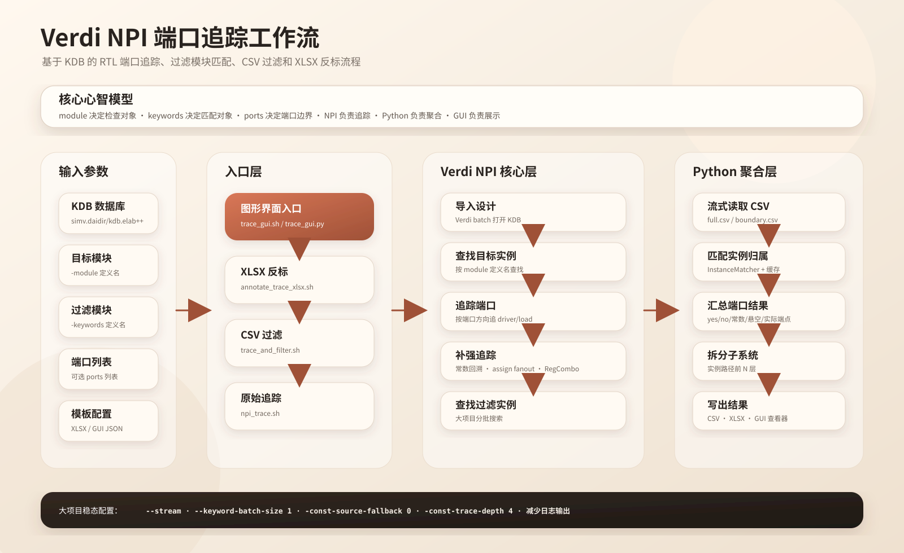

# Verdi NPI Port Trace 工作流学习文档

> 后端迁移提示：本文主体记录旧版直接 Verdi/NPI Tcl 工作流，不能作为当前执行路径的权威说明。当前工具通过 `kdebug_backend.py` 调用公共 kdebug JSON API；请先阅读 [`KDEBUG_BACKEND_MIGRATION.md`](KDEBUG_BACKEND_MIGRATION.md)，旧 Tcl 内容仅用于历史行为对照。

本文面向接手本项目的工程师或大模型。目标是让读者不依赖历史对话，也能理解这个工具为什么存在、如何运行、每个脚本的职责边界，以及在大项目中应该如何稳定使用和继续开发。



## 1. 项目定位

`verdi_npi_port_trace` 是一个基于 Synopsys Verdi NPI 的 RTL 端口连接追踪工具。它不直接解析 RTL filelist，而是读取 VCS/Verdi 已经 elaboration 后生成的 KDB：

```text
simv.daidir/kdb.elab++
```

工具的核心任务是：

1. 给定一个或多个目标 `module` 定义名。
2. 找到这些 module 在当前 KDB 中的所有例化实例。
3. 对目标实例的端口做 driver/load trace。
4. 给定一个或多个 `keywords` module 定义名，找出这些 keywords module 的所有实例。
5. 判断目标端口的方向相关 trace 端点是否连接到 keywords module 实例。
6. 输出 CSV，或把 yes/no、实际 driver/load、常数、悬空、parameter 等信息反标到 XLSX。

这里的 `keywords` 是历史参数名，不是文本关键词。它实际表示“过滤 module 定义名列表”。

## 2. 重要术语

| 术语 | 含义 |
| --- | --- |
| KDB | VCS/Verdi elaboration 数据库，路径通常是 `simv.daidir/kdb.elab++`。 |
| target module / `-module` | 被检查的 Verilog/SystemVerilog module 定义名，不是实例名。 |
| keyword module / `-keywords` | 过滤用 module 定义名列表。工具检查 target 端口是否连接到这些 module 的实例。 |
| target instance | target module 在当前设计里的某个例化实例。 |
| driver | 驱动某个信号或端口的源端。对 input 端口，主要看 driver。 |
| loader/load | 使用某个信号或端口的负载端。对 output 端口，主要看 loader。 |
| full trace CSV | Verdi NPI pass-through trace 输出，信息更完整，也可能包含内部节点。 |
| module boundary CSV | 停在 module 边界附近的 trace 输出，更适合看端口边界连接。 |
| subsystem split | 按实例路径前 N 层拆分 XLSX 输出，一个 subsystem 一个反标文件。 |
| stream mode | Python 端流式聚合 CSV，降低大项目运行期运存。 |
| const source fallback | 源码 fallback，用于补充识别父层 net 的常数 tie。 |

## 3. 必须理解的语义

### 3.1 `-module` 是 module 定义名

例如 RTL 中有：

```verilog
ysyx_22050058_pht ysyx_22050058_pht_u0 (...);
```

命令应写：

```bash
-module ysyx_22050058_pht
```

不要写实例名：

```bash
-module ysyx_22050058_pht_u0
```

### 3.2 `-keywords` 是 module 定义名列表

`-keywords` 不是从 CSV 里做字符串查找。工具会调用 NPI 查找这些 module 的全部例化实例，然后判断 trace 端点是否属于这些实例。

例如：

```bash
-keywords UartPeer,skidbuffer
```

表示“只要目标端口方向相关的 driver/load 来自 `UartPeer` 或 `skidbuffer` 的任意实例，就判定命中”。

### 3.3 端口方向决定看 driver 还是 loader

| target 端口方向 | 主要判断 |
| --- | --- |
| `input` | 看 driver 是否来自 keywords 实例，或是否为常数/悬空/RegCombo 命中。 |
| `output` | 看 loader 是否来自 keywords 实例，或是否为常数/悬空/RegCombo 命中。 |
| `inout` / unknown | driver 和 loader 都检查。 |

## 4. 文件职责

| 文件 | 职责 |
| --- | --- |
| `trace_gui.sh` | GUI 启动入口，自动选择带 `tkinter` 的 Python。 |
| `trace_gui.py` | Tkinter GUI，生成命令、运行脚本、保存/加载配置、查看 CSV/XLSX。 |
| `trace_gui_demo_xlsx.json` | GUI 示例配置。 |
| `annotate_trace_xlsx.sh` | XLSX 反标入口 shell，选择 Python 并调用 `annotate_trace_xlsx.py`。 |
| `annotate_trace_xlsx.py` | XLSX 反标主流程：读模板、找 keyword 实例、trace module、聚合、写 XLSX。 |
| `trace_and_filter.sh` | CSV trace + keywords 过滤入口。 |
| `filter_trace.py` | CSV 过滤、合并、按 target instance 拆分。 |
| `find_instances_batched.py` | 分批调用 Verdi 搜索 keyword 实例，降低单个 Verdi 进程资源峰值。 |
| `npi_trace.sh` | 设置 NPI 环境变量并调用 `npi_port_trace.tcl`。 |
| `npi_port_trace.tcl` | 核心 NPI trace 脚本，导入 KDB、找 target 实例、追踪端口 driver/load。 |
| `npi_find_instances.tcl` | 通过 NPI 查找 module 定义对应的所有实例。 |
| `npi_find_module_params.tcl` | 通过 NPI 采集目标 module 实例 parameter。 |
| `multi_module_trace_template.xlsx` | 多 module 测试模板。 |

## 5. 三条主工作流

### 5.1 GUI 工作流

GUI 不实现新的 trace 语义，它是命令行脚本的前端包装。

流程：

1. 用户运行 `./trace_gui.sh`。
2. `trace_gui.sh` 查找可用 Python，要求能 `import tkinter`。
3. `trace_gui.py` 加载 GUI。
4. 用户填写 KDB、module、keywords、ports、模板、输出等参数。
5. GUI 根据当前 tab 生成底层命令。
6. 用户点击 `Run`。
7. GUI 启动对应 shell/Python/Tcl 脚本。
8. 日志显示在 `Run Log`。
9. 用户点击 `View Result` 查看 CSV/XLSX。

GUI 三种模式：

| GUI tab | 底层命令 | 用途 |
| --- | --- | --- |
| `XLSX Annotate` | `annotate_trace_xlsx.sh` | 反标 Excel，适合最终交付。 |
| `CSV Filter` | `trace_and_filter.sh` | 生成并过滤 CSV，适合调试连接关系。 |
| `Raw Trace` | `npi_trace.sh` | 只跑底层 NPI trace，适合定位 Verdi/NPI 行为。 |

### 5.2 XLSX 反标工作流

这是最完整的工作流，适合项目交付。

入口：

```bash
./annotate_trace_xlsx.sh \
  -template trace_template.xlsx \
  -output annotated.xlsx \
  -lib build/simv.daidir/kdb.elab++ \
  -keywords KeyModA,KeyModB \
  -module TargetModA,TargetModB \
  -ports clk,rst,we,waddr,wdata \
  --stream \
  --keyword-batch-size 1 \
  -const-source-fallback 0 \
  -const-trace-depth 4
```

内部阶段：

1. shell 打印脚本目录、Python 路径和 Python 版本。
2. Python 读取参数，标准化 module、keywords、ports。
3. 检查 KDB 路径。
4. 加载或自动生成 XLSX 模板。
5. 调用 `find_instances_batched.py` 查找 keywords module 实例。
6. 可选调用 `npi_find_module_params.tcl` 采集 target module 实例 parameter。
7. 对每个 target module 调用 `npi_trace.sh`。
8. `npi_trace.sh` 调用 `npi_port_trace.tcl` 生成：
   - `<module>_full.csv`
   - `<module>_module_connections.csv`
9. Python 读取 trace CSV，按端口方向聚合 driver/load。
10. 用 keywords 实例 matcher 判断是否命中。
11. 识别常数、悬空、RegCombo、实际 driver/load 信息。
12. 如果启用 subsystem split，按实例路径前 N 层拆分。
13. 写出一个或多个 XLSX。

输出内容：

| 情况 | XLSX 写入 |
| --- | --- |
| 命中 keywords 实例 | `yes; ...` |
| 未命中但找到实际 driver | `no; driver_actual=...` |
| 未命中但找到实际 loader | `no; loader_actual=...` |
| 常数 driver | `no; driver=Const:<value>` |
| 无 driver | `no; driver=NO_DRIVER` |
| 无 loader | `no; load=NO_LOAD` |
| 跳过参数采集 | `PARAM_SKIPPED` |
| 参数采集失败但继续 | `PARAM_TRACE_FAILED: ...` |

### 5.3 CSV 过滤工作流

入口：

```bash
./trace_and_filter.sh \
  -module TargetMod \
  -lib build/simv.daidir/kdb.elab++ \
  -keywords KeyModA,KeyModB \
  -ports clk,rst,we,waddr,wdata \
  -output target_from_keywords.csv
```

内部阶段：

1. 调用 `npi_trace.sh` 生成 target module 的 full trace 和 boundary trace。
2. 调用 `find_instances_batched.py` 查找 keywords 实例。
3. 调用 `filter_trace.py` 过滤 trace CSV。
4. 输出 boundary 过滤结果、full owner 过滤结果和最终 CSV。
5. 如 target module 有多个实例，可按 target instance 拆分输出。

CSV 模式更适合调试，因为它保留了更多中间文件。

### 5.4 Raw Trace 工作流

入口：

```bash
./npi_trace.sh \
  -module TargetMod \
  -lib build/simv.daidir/kdb.elab++ \
  -ports clk,rst \
  -module-out target_module_connections.csv \
  > target_full.csv
```

Raw Trace 只做 NPI trace，不做 keywords 实例匹配，也不做 XLSX 反标。它适合验证：

- KDB 是否能被 Verdi 导入。
- target module 是否能找到实例。
- 某根端口的原始 NPI driver/load 返回了什么。
- 常数递归和 assign fanout 是否在底层 CSV 中出现。

## 6. NPI Tcl 层工作方式

`npi_port_trace.tcl` 是底层核心。它的输入主要来自环境变量：

| 环境变量 | 含义 |
| --- | --- |
| `NPI_LIB` | KDB 路径。 |
| `NPI_MODULE` | target module 定义名。 |
| `NPI_PORTS` | 可选端口过滤列表。 |
| `NPI_OUTFILE` | full trace CSV 输出路径。 |
| `NPI_MODULE_OUTFILE` | module boundary CSV 输出路径。 |
| `NPI_CONST_SOURCE_FALLBACK` | 是否启用源码 fallback。 |
| `NPI_CONST_TRACE_MAX_DEPTH` | 父 port 常数递归回溯最大深度。 |

底层工作：

1. 导入 KDB。
2. 通过 module 定义名查找所有 target instances。
3. 遍历目标实例端口。
4. 获取端口方向。
5. 按方向选择 high-side 或 low-side trace。
6. 对 driver/load 分别调用 NPI trace API。
7. 对 output loader 额外使用 assign fanout 追踪，补充连续赋值切片场景。
8. 识别常数 literal、父层 port 常数递归、源码 fallback 常数。
9. 输出 full CSV 和 module boundary CSV。

## 7. Python 聚合层工作方式

Python 层负责把 NPI 文本结果转成用户可读的结论。

关键概念：

| 概念 | 说明 |
| --- | --- |
| `TraceRow` | 一行 trace CSV。 |
| `ParamRow` | 一行 parameter 采集结果。 |
| `InstanceMatcher` | 判断某个 signal path 是否属于 keywords 实例，支持缓存。 |
| `PortSummary` | 汇总某个目标实例某个端口的命中情况、常数、悬空、实际 driver/load。 |

stream 模式下，Python 不一次性保存全部 trace 结果，而是边读边聚合：

```text
CSV row -> port summary -> final cell text
```

这对大项目很重要，因为 full CSV 可能很大。

## 8. 大项目稳定性策略

大项目中最容易出问题的是：

1. keywords 很多，查找实例时 Verdi 进程资源峰值过高。
2. full trace CSV 很大，Python 一次性加载会占用大量运存。
3. 源码 fallback 读取大量源码，耗时且占用 I/O。
4. 递归常数回溯层数过大，NPI 查询量增加。
5. 打印所有实例路径，日志巨大。

推荐低峰值配置：

```bash
--stream \
--keyword-batch-size 1 \
-const-source-fallback 0 \
-const-trace-depth 4
```

解释：

| 参数 | 作用 |
| --- | --- |
| `--stream` | Python 端流式聚合，减少运存。 |
| `--keyword-batch-size 1` | 每次只让 Verdi 搜索一个 keyword module，降低单进程峰值。 |
| `-const-source-fallback 0` | 不读取源码 fallback，减少 I/O 和解析成本。 |
| `-const-trace-depth 4` | 限制父 port 回溯深度。 |
| 不开 `--keyword-log-instances` | 防止日志过大。 |

注意：多次启动 Verdi 会变慢，但每次资源峰值更低。对超大项目，稳定性通常比速度更重要。

## 9. 常数检测策略

工具支持三类常数：

### 9.1 直接 literal

```verilog
u_child(.a(1'b0));
```

NPI 通常能直接返回 `Const:<value>`。

### 9.2 父层 net 源码 tie

```verilog
wire tie0;
assign tie0 = 1'b0;
u_child(.a(tie0));
```

这类依赖：

```bash
-const-source-fallback 1
```

前提是 KDB 记录的源码路径在当前机器可访问。

### 9.3 多层父 port 透传后 tie

```text
Child.a <- Parent0.p0 <- Parent1.p1 <- 1'b0
```

这类通过 NPI high-side connection 递归回溯处理，深度由：

```bash
-const-trace-depth <N>
```

控制。

## 10. Assign Fanout Loader 追踪

有些 output 端口连接到父层信号 `A`，而 `A` 又被连续赋值切片：

```verilog
assign B = A[10:0];
assign C = A[20:11];
```

如果 `B` 或 `C` 连接到 keywords 实例，普通 trace 可能只停在 `A`。工具在 loader 侧额外调用 NPI connection API 穿过 assign cell，补充真实 module instance port 端点。

这个能力不依赖源码 fallback。

## 11. XLSX 反标模板结构

模板的基本形态是：

```text
module / ports  | signal0 | signal1 | signal2 | ...
TargetModuleA   |         |         |         |
TargetModuleB   |         |         |         |
```

工具会在 module 和 port 交叉单元格写入反标结果。

当前行为：

1. 如果一个 module 有多个实例，每个实例单独一行。
2. 行内会反标该实例 parameter。
3. 每个 port 单元格写入 yes/no/const/no-driver/no-load/actual 信息。
4. 如果启用 subsystem split，则一个 subsystem 一个 XLSX。

## 12. GUI 设计边界

GUI 只负责：

- 收集参数。
- 生成命令预览。
- 启动底层脚本。
- 显示日志。
- 保存/加载 JSON 配置。
- 查看 CSV/XLSX。

GUI 不应该直接重写 trace 语义。修改 trace 语义时，应优先修改：

1. `npi_port_trace.tcl`
2. `annotate_trace_xlsx.py`
3. `filter_trace.py`

然后再让 GUI 暴露新参数。

## 13. 接手开发建议

大模型或工程师修改本项目时，建议按下面顺序阅读：

1. `README.md`：了解用户使用方式。
2. `WORKFLOW_GUIDE_FOR_LLMS.md`：理解整体架构和数据流。
3. `trace_gui.py`：理解 GUI 参数如何映射到命令行。
4. `annotate_trace_xlsx.py`：理解 XLSX 反标主流程。
5. `npi_trace.sh`：理解 shell 如何传 NPI 环境变量。
6. `npi_port_trace.tcl`：理解底层 Verdi NPI trace。
7. `find_instances_batched.py`：理解大项目 keyword 实例查找策略。
8. `filter_trace.py`：理解 CSV 过滤逻辑。

修改时的原则：

- 不要把实例名当成 module 定义名。
- 不要把 `keywords` 理解为字符串关键字。
- 不要绕过 KDB 改成 filelist 工作流。
- 不要为了快而默认开启大量日志。
- 大项目默认要保护运存峰值。
- GUI 只是包装器，不能成为 trace 语义的唯一实现。
- 新参数要同时支持 GUI 和命令行。
- 修改底层 trace 后要保留中间 CSV，方便 Verdi/NPI 行为复核。

## 14. 推荐测试矩阵

| 测试项 | 目的 |
| --- | --- |
| `bash -n *.sh` | 检查 shell 语法。 |
| `python3 -m py_compile *.py` | 检查 Python 语法。 |
| `trace_gui.py --build-command trace_gui_demo_xlsx.json` | 检查 GUI 配置到命令的映射。 |
| `./npi_trace.sh ...` | 检查底层 NPI trace。 |
| `./trace_and_filter.sh ...` | 检查 CSV 过滤。 |
| `./annotate_trace_xlsx.sh ...` | 检查 XLSX 反标。 |
| 多 `-module` | 检查多个目标 module。 |
| 多 `-keywords` | 检查多个过滤 module。 |
| `-subsystem-level` | 检查 subsystem 拆分。 |
| `-const-source-fallback 0/1` | 检查常数检测开关。 |
| `-const-trace-depth N` | 检查多层父 port 常数回溯。 |
| `-regcombo-as-keyword 0/1` | 检查 RegCombo 命中策略。 |

## 15. 典型命令

### 15.1 GUI

```bash
cd /mnt/hgfs/VMshare/CPU_CORE/ysyx/npc/csrc/verdi_npi_port_trace
./trace_gui.sh
```

### 15.2 XLSX 反标

```bash
./annotate_trace_xlsx.sh \
  -template multi_module_trace_template.xlsx \
  -output annotated.xlsx \
  -lib build/simv.daidir/kdb.elab++ \
  -keywords SkidPeer,skidbuffer \
  -module skidbuffer,SkidPeer \
  -ports i_clk,i_reset,i_valid,o_ready,i_data,o_valid,i_ready,o_data,clk,rst,src_valid,src_ready,src_data,dst_valid,dst_ready,dst_data \
  -subsystem-level 2 \
  --stream \
  --keyword-batch-size 1 \
  -const-source-fallback 0 \
  -const-trace-depth 4
```

### 15.3 CSV 过滤

```bash
./trace_and_filter.sh \
  -module skidbuffer \
  -lib build/simv.daidir/kdb.elab++ \
  -keywords SkidPeer,skidbuffer \
  -ports i_clk,i_reset,i_valid,o_ready,i_data \
  -output skidbuffer_from_keywords.csv \
  --keyword-batch-size 1 \
  -const-source-fallback 0 \
  -const-trace-depth 4
```

### 15.4 Raw Trace

```bash
./npi_trace.sh \
  -module skidbuffer \
  -lib build/simv.daidir/kdb.elab++ \
  -ports i_clk,i_reset \
  -module-out skidbuffer_module_connections.csv \
  -const-source-fallback 0 \
  -const-trace-depth 4 \
  > skidbuffer_full.csv
```

## 16. 最小心智模型

可以把整个工具记成一句话：

```text
KDB -> NPI 找实例和 trace -> Python 聚合判断 -> CSV/XLSX/GUI 展示
```

更具体一点：

```text
module 决定检查谁
keywords 决定关心谁
ports 决定检查哪些端口
端口方向决定看 driver 还是 loader
NPI 负责追踪
Python 负责聚合和反标
GUI 负责收参和展示
```
